<!--\pagenumbering{gobble}-->
\setlength{\parindent}{36pt}

# Introduction

> This section should outline the real-world background and context of your model. Discuss
the motivation one might have to study this model. You may want to research the relevant
literature and include some citations to support your framing of the real-world context
(depending on the project). Be sure to include only background information and context
that is directly related to your research project. Really focus on what the reader needs to
know to understand your work, and be interested and excited by it.

> The final paragraph of your Introduction should frame your research question and de-
scribe what you will be studying in your paper. Briefly mention, in words, what you will
be doing and showing in the rest of the paper. It is often good to lay out your main find-
ing/result here, too. A good Introduction section for an applied mathematics paper ideally
has no mathematical symbols or jargon; instead, it should be focused on the real-world con-
text and what you are trying to study. The math is a tool you will introduce later, not the
main focus of the paper.

<!-- Consider @Talele2025, a great guy who wrote some cool stuff. -->

<!-- Bipolar arms races between two countries @Wallace1979  -->

# Base Model

For either hypothetical country, P and G, the assumptions for our base model are as follows:

1. The rate of change in one nation's arms spending is directly proportional to the other nation's arms spending
1. The rate of change in one nation's arms spending is also negatively directly proportional to that nation's own current spending
1. There may be underlying trust and hostility between the two nations, which will have a constant effect on rate of change
1. For now, we assume that each country has infinite amounts of wealth at their disposal (not realistic at all in a real-world context)

Based on these assumptions, the following model was derived:
\begin{equation}
    \dfrac{\partial p}{\partial t} = ag(t) - bp(t) + r
\end{equation}
\begin{equation}
    \dfrac{\partial g}{\partial t} = cp(t) - dg(t) + s
\end{equation}

In particular, $p(t),g(t)$ denote the arms spending at time $t$ for countries P and G respectively. Meanwhile, $\dfrac{\partial p}{\partial t},\dfrac{\partial g}{\partial t}$ denote the rate of change of each country's arm spending. The variables $a,c$ measure the effect of mutual fear that each country has on the other's arms spending, $b,d$ measure the effect of expenditure burden that each country has on their own spending, and $r,s$ measure the underlying hostility or trust that the each nation has to another.

For the sake of realism, $p(t),g(t)$ are held to be non-negative values as negative arms spending would not make sense in this scenario.

Moreover, to ensure that mutual fear and expenditure burden match the behavior as laid out in the assumptions, $a,b,c,d$ are held to be non-negative as well. On the other hand, $r,s$ can assume any value where negative values denote trust and positive values denote hostility.

The parameters in the model $(a,b,c,d,r,s)$ assume no form of units as they serve as abstractions of qualitative measures (i.e. it would be hard to attach a unit to expenditure burden or fear). However, the state variables $p(t),g(t)$ themselves would be expressed in some common currency (e.g. U.S. dollars) and the derivatives of those state variables $(\dfrac{\partial p}{\partial t},\dfrac{\partial g}{\partial t})$ would be expressed in that currency over time (e.g. U.S. dollars per year).

Theoretically speaking, this model is a system of multivariate, autonomous linear differential equations. In this situation, the Jacobian would have to be computed for the purposes of stability analysis.

# Analysis of Base Model

To facilitate the stability analysis of the base model, we now reformulate the system of equations into matrix form:
$$
\begin{bmatrix}
     \dfrac{\partial p}{\partial t} \\  
     \dfrac{\partial g}{\partial t}
\end{bmatrix}
=
\begin{bmatrix}
    -b & a \\
    c & - d
\end{bmatrix}
\begin{bmatrix}
    p(t) \\ g(t)
\end{bmatrix}
+
\begin{bmatrix}
    r \\ s
\end{bmatrix}
$$

## Analysis without underlying trust or hostility

As a starting point, we assume that both nations have no underlying trust or hostility such that $r=s=0$. Thus, the model equations are now:
$$
\begin{bmatrix}
     \dfrac{\partial p}{\partial t} \\  
     \dfrac{\partial g}{\partial t}
\end{bmatrix}
=
\begin{bmatrix}
    -b & a \\
    c & - d
\end{bmatrix}
\begin{bmatrix}
    p(t) \\ g(t)
\end{bmatrix}
$$

Note that by having the system in linear form, the Jacobian is simply the matrix
$$J=\begin{bmatrix}
    -b & a \\
    c & - d
\end{bmatrix}$$

Setting $r=s=0$ lends a unique advantage in that the resulting system of linear differential equations is now homogenous (i.e. there is no constant term). This means that a closed-form of the state-variables can be found in the form of:
$$
\begin{bmatrix}
     p(t) \\  
     g(t)
\end{bmatrix}
= P
\begin{bmatrix}
    e^{\lambda_1 t} & 0 \\
    0 & e^{\lambda_2 t}
\end{bmatrix}
P^{-1}
\begin{bmatrix}
    p(0) \\ g(0)
\end{bmatrix}
$$

Where $\lambda_1,\lambda_2$ denotes the eigenvalues of the Jacobian $J$, $P$ denotes the matrix of eigenvectors, and $p(0),g(0)$ denotes the initial spending of the two countries.

To determine equilibrium points, set
$$\begin{bmatrix}
     \dfrac{\partial p}{\partial t} \\  
     \dfrac{\partial g}{\partial t} \end{bmatrix}
=0$$

Thus,
$$
\begin{bmatrix}
     0 \\  
     0
\end{bmatrix}
=
\begin{bmatrix}
    -b & a \\
    c & - d
\end{bmatrix}
\begin{bmatrix}
    p(t) \\ g(t)
\end{bmatrix}
$$

An obvious equlibrium that can be derived from this formulation is:
$$\begin{bmatrix}
    p^*(t) \\ g^*(t)
\end{bmatrix} = \begin{bmatrix}0 \\ 0\end{bmatrix}$$

This equilibrium point corresponds to a scenario where both nations mutually demilitarize.

To determine the stability conditions of such a scenario, we need to compute the Jacobian. Since the system of differential equations are already in linear form, the Jacobian is simply given by:
$$
J =
\begin{bmatrix}
    -b & a \\
    c & - d
\end{bmatrix}
$$

In order for the scenario of mutual disarmament to be asymptotically stable, the eigenvalues of the jacobian should both be negative. The eigenvalues are given by:
$$
\det(J-I\lambda) =
\begin{bmatrix}
    -b-\lambda & a \\
    c & - d-\lambda
\end{bmatrix} = \lambda^2 +(b+d)\lambda +bd-ac = 0
$$

The solutions to these eigenvalues are of the form:
$$
\lambda = \frac{-(b+d)\pm\sqrt{(b+d)^2-4(bd-ac)}}{2}
$$

Expanding the square term in the discriminant and simplifying the equation yields the following:
$$
\lambda = \frac{-(b+d)\pm\sqrt{(b-d)^2+4ac}}{2}
$$

It should be noted that because of the non-negative restrictions imposed upon $a,b,c,d$, the discriminant will always remain positive. From this, we expect that the model will always behave monotonically. In other words, the arms spending of countries P and G will not oscillate.

To check when the eigenvalues remain negative, we look for conditions when $(b+d)$ is greater than $\sqrt{(b-d)^2+4ac}$ in magnitude. After doing some algebra, the result turns out to be: $bd>ac$. In the context of the scenario, the arms spending of countries P and G will converge to complete mutual disarmament if their combined expenditure burden outweighs the combined mutual fear they have for each other.

On the other hand, if $bd<ac$, then the combined mutual fear will outweigh the combined expenditure burden. In this case, the equilibrium of mutual disarmament will become unstable and both nations will engage in a perpetual arms race.

Another point to consider is what happens when $bd = ac$. In this case, we substitute $ac =bd$ in the formula for the eigenvalues:
$$
\lambda = \frac{-(b+d)\pm\sqrt{(b+d)^2-4(bd-ac)}}{2} \\
\lambda = 0,-(b+d)\\
$$

In this case, one eigenvalue is negative and the other is 0. The closed form sheds further light onto what this implies for the model. To this end, the eigenvalues were substitued back in the Jacobian to derive the eigenvectors.

These eigenvectors are
$$\vec{v}_1=\begin{bmatrix}
\frac{a}{b}
\\
1
\end{bmatrix}$$ for $\lambda_1 = 0$ and
$$
\vec{v}_2=\begin{bmatrix}
-\frac{a}{d}
\\
1
\end{bmatrix}$$ for $\lambda_2 = -(b+d)$.

The closed form solution is therefore:
$$
\begin{bmatrix}
     p(t) \\  
     g(t)
\end{bmatrix}
=
\begin{bmatrix}
    \frac{a}{b} & -\frac{a}{d} \\
    1 & 1
\end{bmatrix}
\begin{bmatrix}
    e^{(0) t} & 0 \\
    0 & e^{-(b+d) t}
\end{bmatrix}
\begin{bmatrix}
    \frac{a}{b} & -\frac{a}{d} \\
    1 & 1
\end{bmatrix}^{-1}
\begin{bmatrix}
    p(0) \\ g(0)
\end{bmatrix}
$$

To determine the long-term behavior of the closed form, we let $t\to\infty$, which results in the following convergence.

$$
\begin{bmatrix}
     p(\infty) \\  
     g(\infty)
\end{bmatrix}
=
\begin{bmatrix}
   \frac{dp(0)+ag(0)}{b+d} \\
   \frac{cp(0)+bg(0)}{b+d}
\end{bmatrix}
$$

Within the scope of the scenario, this convergence suggests that both countries will reach a stabilized level of spending contingent on what they were initially spending.

### Summary

To summarize the analysis, the base model without any underlying trust or hostily has three types of convergences. Attached alongside each explanation of these convergences are vector plots to illustrate the scenarios. These vector plots were constructed using R. For each R simulation, the parameter values are listed in the title of each plot. The vector plot shows the direction of the nations' arms spending for each possible point in the simulation (showcased by the arrows). The red lines indicate the possible trajectories that each nation's arm spending can take based on their initial spending.

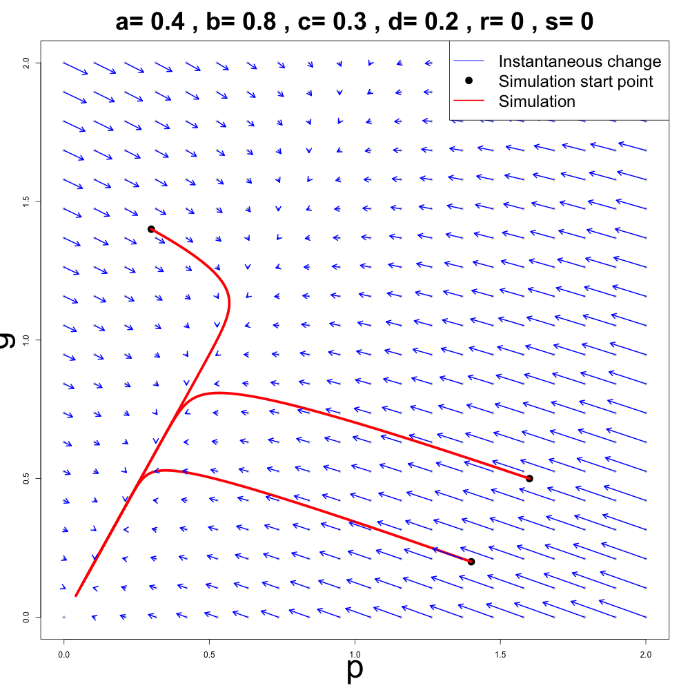{fig-pos="H" width=50%}

When $bd>ac$, both countries mutually disarm for various initial spending points ((0,0) is a stable equilibrium point). Figure 1 indicates that all the paths in this scenario reach (0,0)

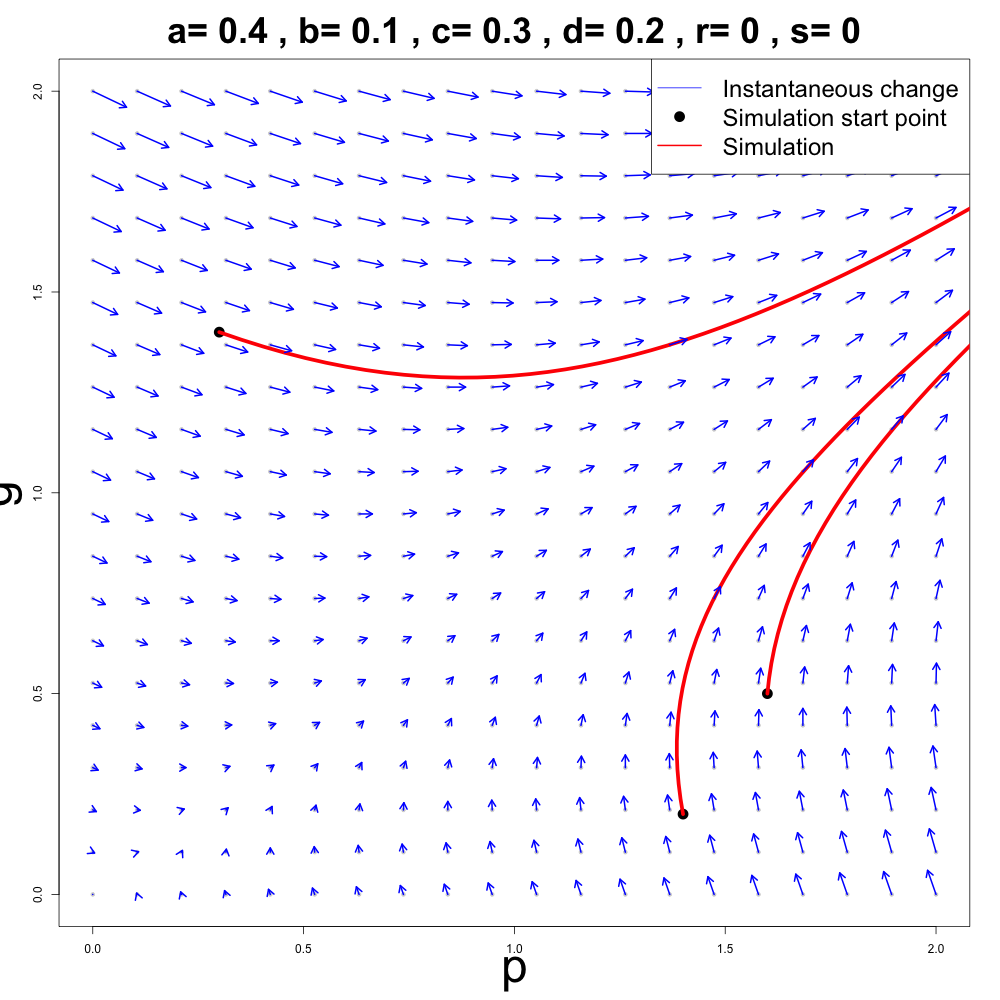{fig-pos="H" width=50%}

When $bd<ac$, both countries engage in an a perpetual arms race ((0,0) is an unstable equilibrium point). Figure 2 shows each simulation path veering away from (0,0) and going beyond the borders of the graph.

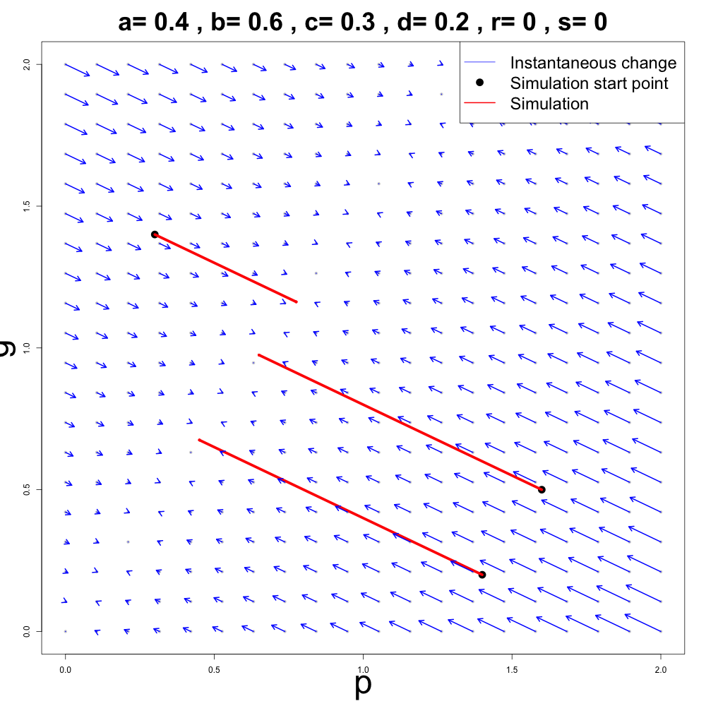{fig-pos="H" width=50%}

When $bd=ac$, both countries reach a stabilized level of spending contingent on initial spending (There is a line of stable equilibrium points). Figure 3 shows each path reaching to a stable line in a straight trajectory.

## Analysis with trust or hostility

Now that we assume $r,s$ to be some other value other than zero, the model is not homogenous anymore, meaning that there is not a convenient closed form solution of the system as there was before.

The equilibrium point also changes:

$$\begin{bmatrix}
    p^*(t) \\ g^*(t)
\end{bmatrix} = \begin{bmatrix} \frac{rd+sa}{bd-ac} \\  \frac{rc+sb}{bd-ac}\end{bmatrix}$$

Now the convergences of the model may not necessarily converge to zero. To determine the stability conditions of this equilibrium, the Jacobian from the previous form of the model can be reused as the system is still linear. In this case, we have the same stability conditions for the equilibrium point as before: $bd>ac$.

To determine what happens when $bd=ac$, we conduct simulations to adjust the values of r and s. We uncover four cases when we loosen r and s conditions, allowing our trust/hostility parameters to take on $r,s \neq 0$ values. For each case, we provide an explanation accompanied by a vector plot which visualizes convergence. Vector plots were constructed using R, we provide the parameter values in the title of each plot for each case. The vector plot shows the direction of the nations' arms spending for each possible point in the simulation (showcased by the arrows). The red lines indicate the possible trajectories that each nation's arm spending can take based on their initial spending.

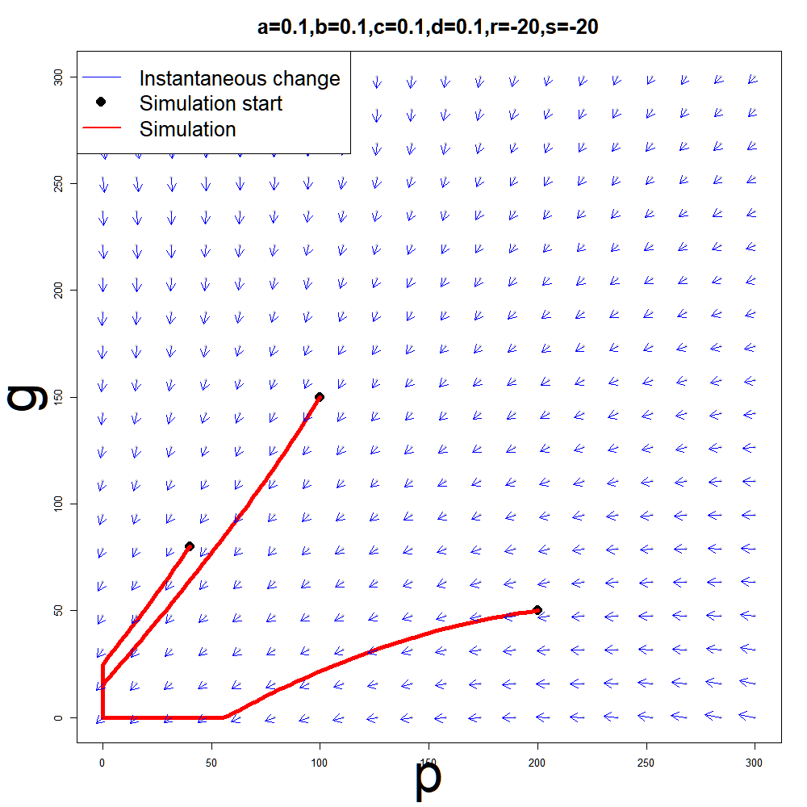{fig-pos="H" width=50%}

We observe mutual disarmament in Figure 4, in which spending for all trajectories decays to (0,0) for both nations, when $r<0$ and $s<0$. This represents opposing nations trusting each other. This first case is most similar to the mutual disarmament seen when r and s are zero; however, this mutual disarmament is solely driven by trust between Nations P and G.

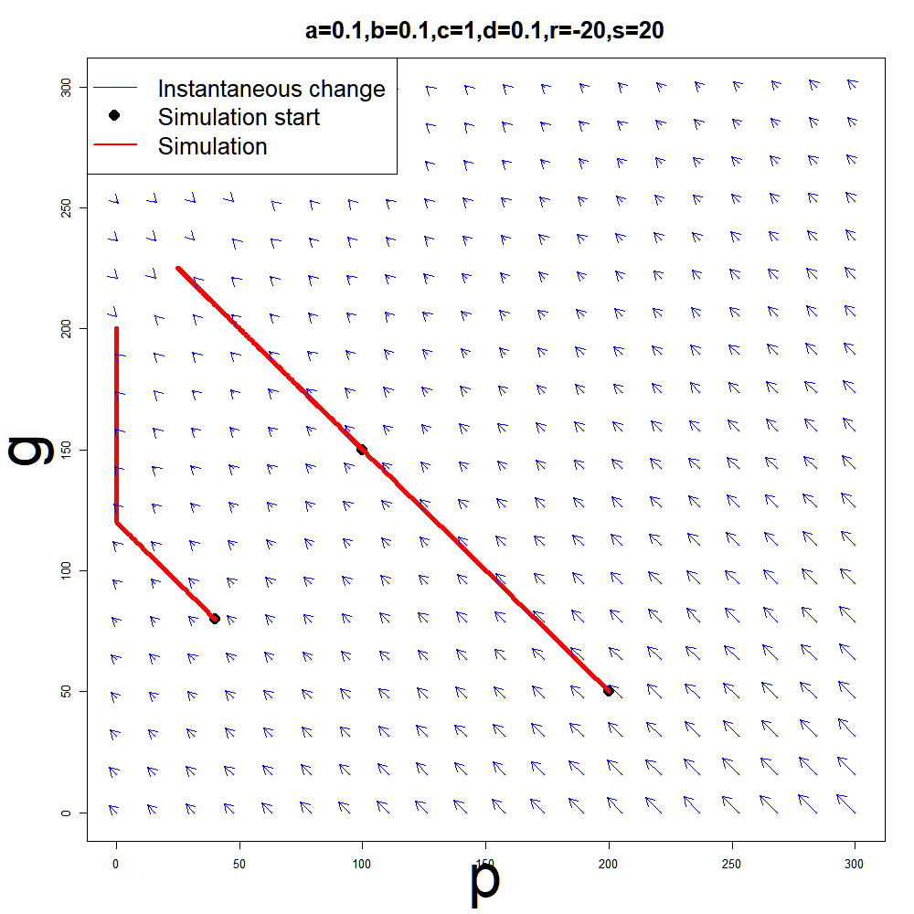{fig-pos="H" width=50%}

When r and s are of opposing sign, we find that one nation is conciliatory and will disarm, decaying to (0,0), while the other nation is hostile and will arm itself (with bound, not infinitely) for all trajectories. In Figure 5, we set $r<0$ and $s>0$ and observe that, for all trajectories, Nation P fully disarms, while Nation G converges to a bounded value depending on the inital conditions of the system and system parameters. 

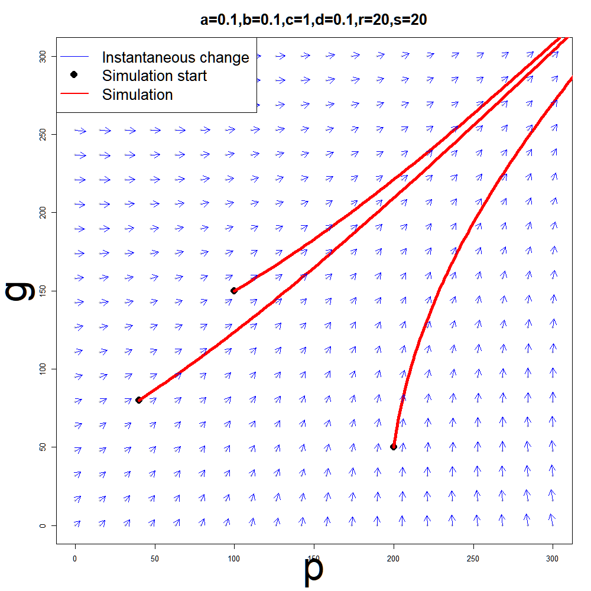{fig-pos="H" width=50%}

We observe a perpetual arms race in Figure 6, in which spending grows without bound for both nations, when $r>0$ and $s>0$. This represents that opposing nations hold independent grievances. Arms spending will diverge the quickest as Nations P and G arm independently and reactively to the other nation arming itself. It is important to note that this perpetual aramament is balanced; as one can observe, the red trajectory lines converge in a symmetric fashion relative to x- and y-axes.

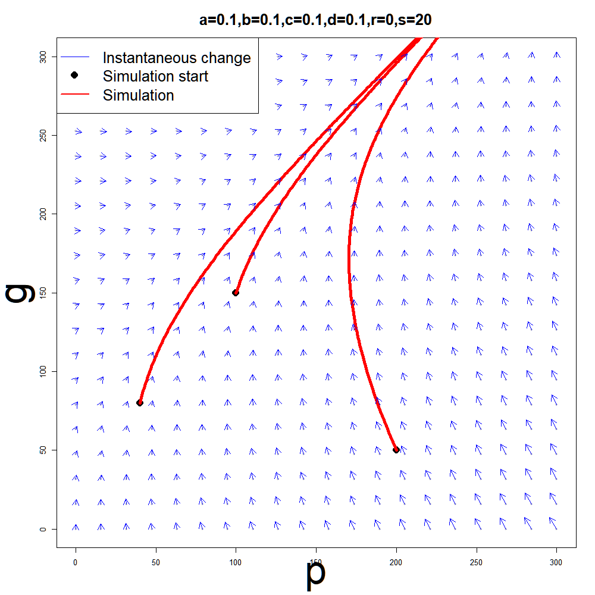{fig-pos="H" width=50%}

We observe a perpetual arms race in Figure 7, in which spending grows without bound for both nations. When one of r and s is set to zero (no feelings towards the opposing nation), and the other is set to a positive value (hostile feelings towards the opposing nation). Unlike in the previous perpetual arms race, this aramament is unbalanced; one nation drives the arms race while the other reacts and arms accordingly. In this case, we set $r=0$ and $s>0$ and observe that Nation G drives the arms race while Nation P lags behind in spending; the red trajectory converge in an asymmetric fashion relative to x- and y-axes, growing more quickly in the y-axis (Nation G arms spending).

We believe that the inclusion of $r,s \neq 0$ possiblities, we more accruately predict how real-world nations react to the (dis)aramament of their contemporaries. With $r,s \neq 0$, we can account for goodwill and grievance between nations, where in previous cases with parameters r and s excluded, we could only predict independent behaviour. This model still has flaws, however. In particular, nations are able to arm themselves without bound, which is not realistic as money is a finite resource. We hope that our model extension will correct the issues that our base model is restricted by.

<!-- > This subsection should describe the various analysis you’ve performed on your base model
and the results you’ve obtained from them. You should be using a mix of analytical tools
(e.g., finding equilibrium points, determining stability) and numerical tools (e.g., model sim-
ulations in R). When discussing analytical calculations, you don’t need to list out every
single step of your calculation; just present the important/key steps. When discussing nu-
merical simulations, you should describe what your R code is doing and present some plots
to supplement your written descriptions; all R code should be presented in an appendix at
the end of the paper (see below). Be sure to describe what these analysis tell you about your
base model and what predictions they make (this should be in the context of the real-world
scenario framing your project). -->

# Model Extension

<!-- > Here, you should describe the extension you’ve chosen to study for your model. Start by
discussing what the extension is and how you plan to change your base model to account
for it. Similar to the base model subsection, be sure to talk about any assumptions in
your modelling, define state variables and parameters (including units), and describe any
modelling choices made. In particular, you should highlight how your extended model differs
from your base model. If appropriate, it would be good to include a model diagram. You
should also write out the model equations. Do not discuss any analysis of the extended model
here. That will go in the next section -->

## Mutual Logistic Fear Model

One major limitation of the base model is the assumption that each country has access to infinite resources. In reality, arms spending is constrained by each country's limited amounts of funds. As a result, the base model produces unrealistic outcomes such as unbounded growth in arms expenditure. To address this limitation, we extend the model by introducing logistic growth terms.

### Model overview

For either hypothetical country P and G, the assumptions for the extended model are as follows:

1. The rate of change in one nation’s arms spending follows a logistic growth depending on the other nation’s arms spending. This is accompanied by a finite resource constraint that limits how much each country can spend.
2. The rate of change is negatively proportional to the nation’s own current spending.
3. There may still be underlying trust or hostility between the two nations, which has a constant effect on the rate of change.

<!--### Model Formulation
To incorporate resource limits, we introduce carrying capacities $K_p$ and $K_g$, which represent the maximum sustainable arms levels for countries P and G respectively. The mutual fear terms are now scaled by logistic factors that reduce growth as spending approaches these limits.-->

Based on these assumptions, the following model was formulated:
\begin{equation}
\frac{\partial p}{\partial t} = a\left(1 - \frac{p(t)}{K_p}\right)g(t) - bp(t) + r
\end{equation}
\begin{equation}
\frac{\partial g}{\partial t} = c\left(1 - \frac{g(t)}{K_g}\right)p(t) - dg(t) + s
\end{equation}

Here, $K_p, K_g$ denote the maximum level of sustainable arms spending for countries P and G respectively. The units these parameters assume would be in a common currency such as U.S. dollars. The rest of the parameters and state variables assume the same meaning as specified for the base model.

<!-- ### Definition of Variables and Parameters

- $p(t), g(t)$: arms spending of countries P and G

Parameters:
- $a, c$: mutual fear coefficients
- $b, d$: expenditure burden coefficients
- $r, s$: exogenous trust/hostility terms
  - $r, s > 0$: hostility / pressure to increase arms
  - $r, s < 0$: trust / pressure to reduce arms
- $K_p, K_g$: carrying capacities representing maximum sustainable arms levels -->

### Differences from the Base Model

The extended model differs from the base model in one fundamental way: the inclusion of the logistic terms $\left(1 - \frac{p}{K_p}\right)$ and $\left(1 - \frac{g}{K_g}\right)$.

In particular:

- The base model allows for unbounded growth when mutual fear dominates.
- The extended model prevents unbounded growth by enforcing resource constraints.

This extension therefore provides a more realistic representation of arms dynamics by combining strategic interaction with physical and economic limitations.

## Analysis of Mutual Logistic Fear Model

<!-- In contrast with the base model, there is generally no simple closed-form equilibrium such as $(0,0)$ unless the trust/hostility terms are chosen appropriately. Instead, the equilibria depend jointly on the parameters
$$
a,b,c,d,r,s,K_p,K_g.
$$

Thus, the long-term behavior of the extended model is governed by the location and stability of the solutions to this nonlinear system. -->

### Jacobian Matrix

To determine the local stability of an equilibrium point, we compute the Jacobian matrix:
$$
J(p,g)=
\begin{bmatrix}
\frac{\partial f}{\partial p} & \frac{\partial f}{\partial g} \\
\frac{\partial h}{\partial p} & \frac{\partial h}{\partial g}
\end{bmatrix}
$$

After computing the partial derivatives, the Jacobian of the extended model is
$$
J(p,g)=
\begin{bmatrix}
-\frac{ag}{K_p}-b & a\left(1-\frac{p}{K_p}\right) \\
c\left(1-\frac{g}{K_g}\right) & -\frac{cp}{K_g}-d
\end{bmatrix}
$$

Evaluating this Jacobian at an equilibrium point $(p^*,g^*)$ yields
$$
J(p^*,g^*)=
\begin{bmatrix}
-\frac{ag^*}{K_p}-b & a\left(1-\frac{p^*}{K_p}\right) \\
c\left(1-\frac{g^*}{K_g}\right) & -\frac{cp^*}{K_g}-d
\end{bmatrix}
$$

The eigenvalues of this matrix determine the local stability of the equilibrium.

### Equilibrium Points 

We set:
$$
a\left(1 - \frac{p^*}{K_p}\right)g^* - bp^* + r = 0
$$
$$
c\left(1 - \frac{g^*}{K_g}\right)p^* - dg^* + s = 0.
$$

These equations define the equilibrium point $(p^*, g^*)$.

Rearranging the first equation yields:
$$
a\left(1 - \frac{p^*}{K_p}\right)g^* = bp^* - r,
$$
and hence,
$$
g^* = \frac{K_p(bp^* - r)}{a(K_p - p^*)}, \qquad p^* \neq K_p.
$$

Similarly, rearranging the second equation gives:
$$
c\left(1 - \frac{g^*}{K_g}\right)p^* = dg^* - s,
$$
and thus,
$$
p^* = \frac{K_g(dg^* - s)}{c(K_g - g^*)}, \qquad g^* \neq K_g.
$$

## Stability Conditions

For a two-dimensional system, an equilibrium point is locally asymptotically stable if the Jacobian evaluated at that point has:

$$
\operatorname{tr}(J(p^*,g^*))<0
\qquad \text{and} \qquad
\det(J(p^*,g^*))>0.
$$

### Trace

The trace is
$$
\operatorname{tr}(J(p^*,g^*))=
\left(-\frac{ag^*}{K_p}-b\right)+\left(-\frac{cp^*}{K_g}-d\right).
$$

So,
$$
\operatorname{tr}(J(p^*,g^*))=
-\frac{ag^*}{K_p}-\frac{cp^*}{K_g}-(b+d).
$$

Since
$a,b,c,d,K_p,K_g,p^*,g^* \geq 0,$
it follows that
$\operatorname{tr}(J(p^*,g^*))<0$
for any nonnegative equilibrium point, provided $b+d>0$.

Thus, in the extended model, the trace is automatically negative under the natural assumptions of the scenario.

### Determinant

The determinant is
$$
\det(J(p^*,g^*))=
\left(-\frac{ag^*}{K_p}-b\right)\left(-\frac{cp^*}{K_g}-d\right)
-
a\left(1-\frac{p^*}{K_p}\right)c\left(1-\frac{g^*}{K_g}\right).
$$

Expanding this gives
$$
\det(J(p^*,g^*))=
\left(b+\frac{ag^*}{K_p}\right)\left(d+\frac{cp^*}{K_g}\right)
-
ac\left(1-\frac{p^*}{K_p}\right)\left(1-\frac{g^*}{K_g}\right).
$$

Unlike the base model, the determinant of the Jacobian in the extended model depends explicitly on the equilibrium values $p^*$ and $g^*$. 

As a result, it is generally not possible to derive a simple analytical condition for stability in terms of the parameters alone.

### Eigenvalues and Stability

The eigenvalues of the Jacobian are given by
$$
\lambda = \frac{\operatorname{tr}(J(p^*,g^*)) \pm \sqrt{\operatorname{tr}(J(p^*,g^*))^2 - 4\det(J(p^*,g^*))}}{2}.
$$

Clearly, this expression depends on the equilibrium values $p^*$ and $g^*$, which are not generally available explicitly. Consequently, the eigenvalues do not yield simple analytical conditions for stability, unlike in the base model.

### Simulations

 We consider the following three representative parameter regimes while keeping $K_p = K_g = 5$ fixed.

#### Case 1: $bd < ac,\; r < 0,\; s < 0$

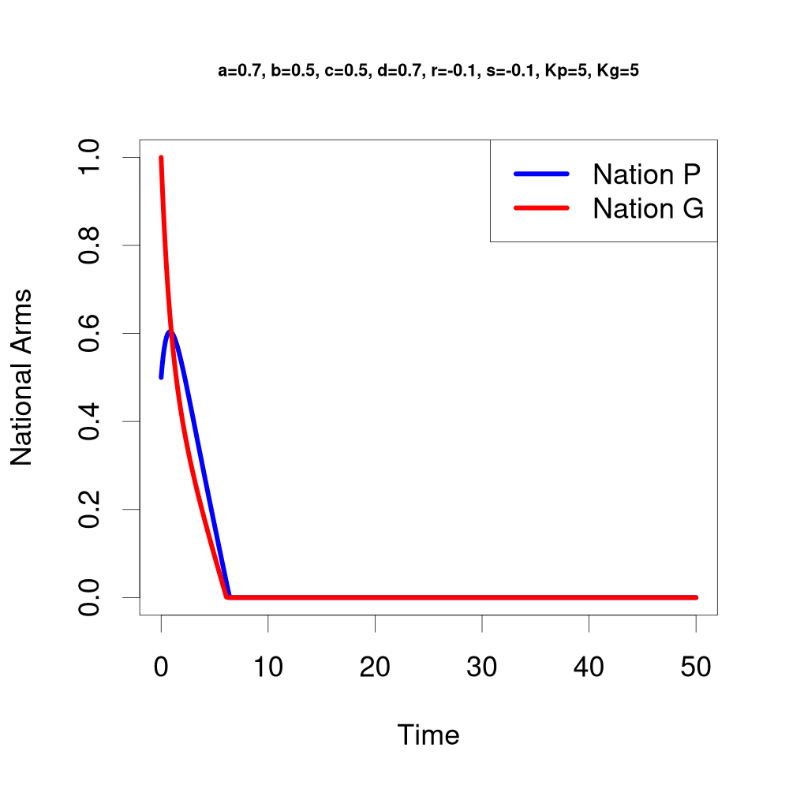{fig-pos="H" width=70%}

In this case, both countries experience negative external pressure, representing trust or incentives to de-escalate. Arms spending falls over time, leading to mutual disarmament.

#### Case 2: $bd = ac,\; r < 0,\; s > 0$

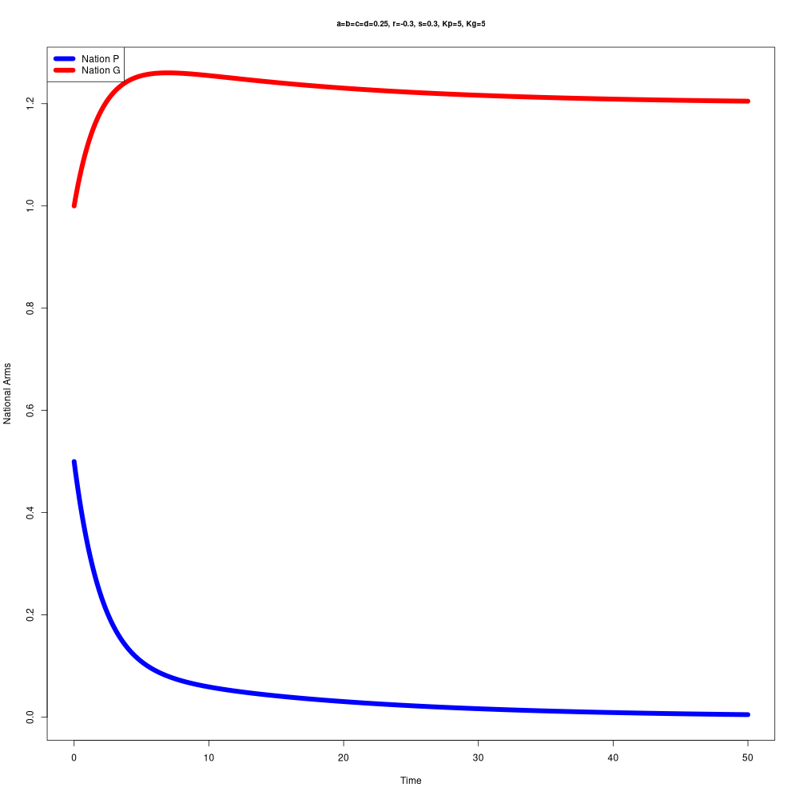{fig-pos="H" width=70%}

Here, the two countries face asymmetric external pressures. Country P experiences trust or downward pressure, while country G experiences hostility or upward pressure. The model predicts stabilization, but at unequal long-run spending levels.

#### Case 3: $bd > ac,\; r > 0,\; s > 0$

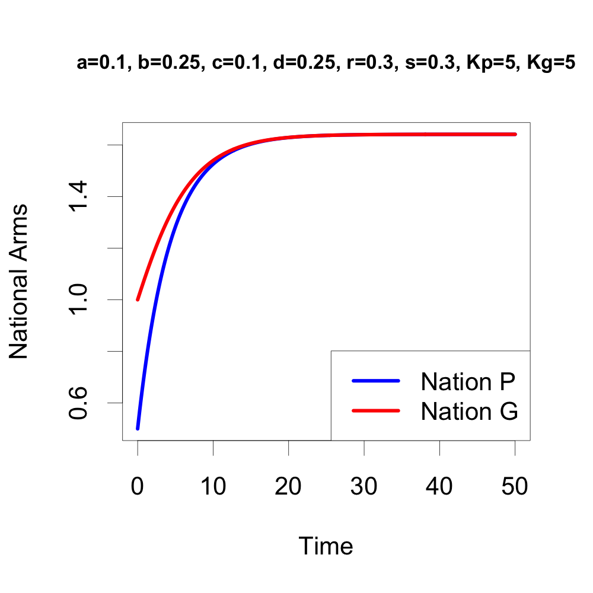{fig-pos="H" width=70%}

In this case, both countries experience positive external pressure, representing hostility or incentives to increase arms. Both countries converge to a high steady-state level of arms spending.

# Results
## Sensitivity Analysis
With regards to the sensivity, we tested how changes in each of the variables in our model would impact nations arms spending. Here, only $a$,$b$, and $r$ will be tested, but the conclusions relate to $c$,$d$ and $s$ in the same way respectively.

### Sensitivity of *a*:

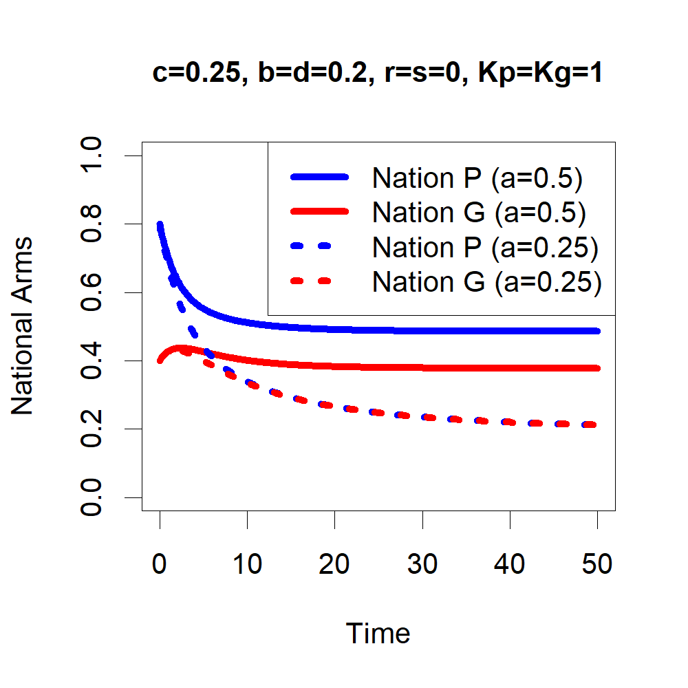{fig-pos="H" width=70%}

In this case, we can see that increases in one country's **mutual fear (_a_)** will lead to increases in both countries' spending at all times. This is due to the fact that a higher ***a*** will lead to country **P** wanting to spend more for each unit of **G**'s arms, so **P**'s arms will be higher. Since $c>0$ (model definitition), this higher level of **P**'s arms will also lead to higher arms spending by **G**.

### Sensitivity of *b*:

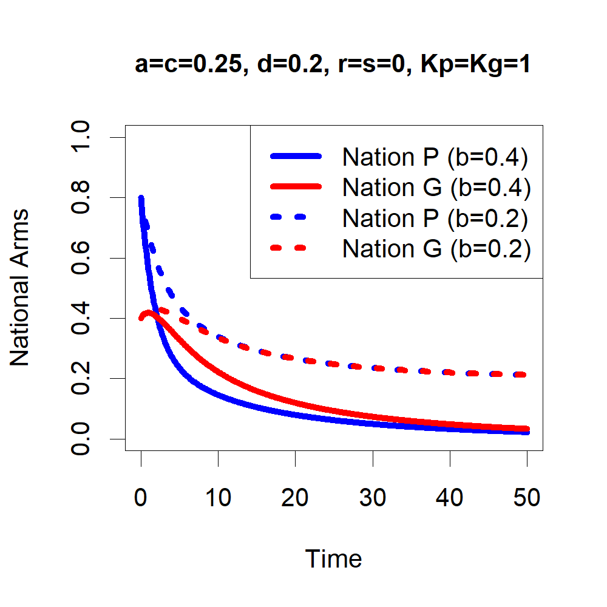{fig-pos="H" width=70%}

In this case, we can see that increases in one country's **expenditure burden (_b_)** will lead to decreases in both countries spending at all times, this is due to the fact that a higher ***b*** will lead to **P** wanting to spend less for each unit of **P**'s arms, so **P**'s arms will be lower. Since $c>0$ (model definitition), this lower level of **P**'s arms will also lead to lower **G**'s arms spending

### Sensitivity of *r*:

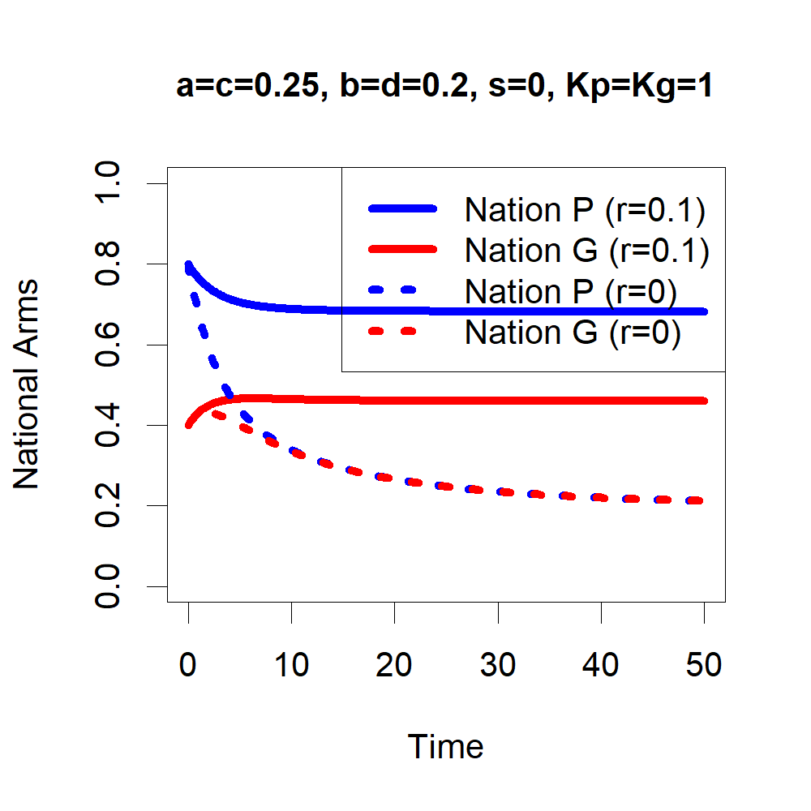{fig-pos="H" width=70%}

In this case, we can see that increases in one country's **trust/hostility (_r_)** will lead to increases in both countries' spending at all times. This is due to the fact that a higher ***r***  will lead to **P** wanting to spend more due to its higher grievance towards **G**, so **P**'s arms will be higher. Since $c>0$ (model definitition), this higher level of **P** arms will also lead to higher **G** arms spending.

<!-- > n this section, you should describe the analysis you performed on your extended model. Be
sure to motivate your analysis in the context of your research question (i.e., why do you
want to perform each analysis, what are you hoping it will tell you). These analysis can be
purely simulation-based: you are not required to perform any mathematical analysis of your
extended models, but if you can, you should! Mathematical analysis generally tell you more
about model behaviour than simulations (when both are possible). You should be including
plots here, as well, to go along with any simulations you did. Unlike with the draft, this
section of the paper should now be complete and all results should be discussed in the pape -->

# Discussion

> This is the final section of the main body of your paper. Start by briefly summarizing
the main results you presented in the last section and relating them back to your research
question. This is also where you should be providing answers, based on your results, to your research question(s). Be sure to interpret your results in the context of the real-world
scenario framing your project. What are the implications of your results?

> You should also discuss limitations of your work. This is usually related to the modelling
assumptions you made before. When are your results applicable and when are they not
applicable? What factors have you omitted from your model that may affect the predictions?
This is important to discuss, otherwise the reader may come away from your paper with the
impression that your results are universal which is rarely the case.

> Finally, you should discuss possible directions for future research. Did your results open
up any other questions? Where else could you go with this work? Are there other things
you’ve read about in the literature that could be interesting to look at? You should also use
this as a way to conclude your whole paper.

<!-- { height=130px } -->

\pb

# Appendix: Individual Contributions

### Zeyn Jaswal

1. Presentation: Overview
1. Report: Introduction and Conclusion

### Azzaam Khan
1. Presentation: Base Model
1. Report: Base Model

### Timothy Palin
1. Presentation: Results
1. Report: Results

### Tony Xu
1. Presentation: Logistic Mutual Fear Extension
1. Report: Logistic Mutual Fear Extension

### Meredith Reeves
1. Presentation: Public Sentiment
1. Report: Public Sentiment

\pb

# References
